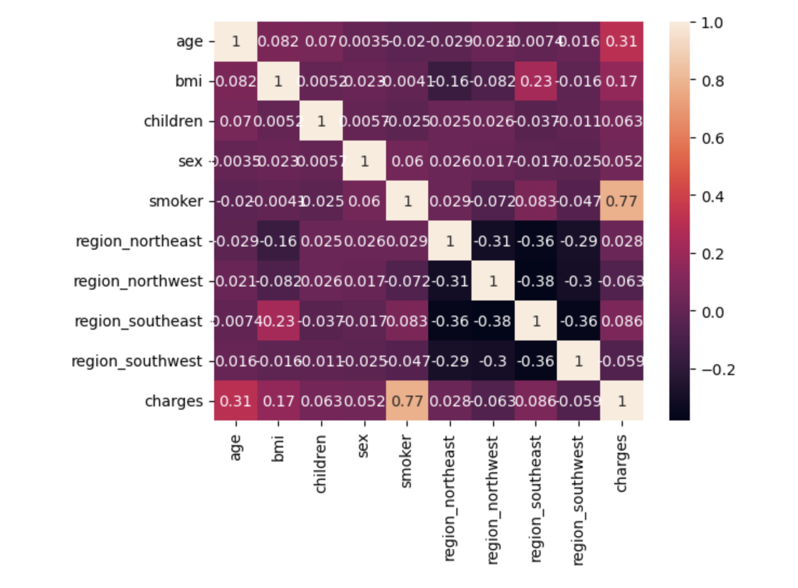

# Medical Insurance Cost Prediction Using Machine Learning


This project explores the use of machine learning to predict individual medical insurance costs from demographic and health-related attributes. The objective was to investigate how different neural network architectures and training configurations influence regression performance on structured healthcare data.


## Project Overview

Medical insurance costs depend on several interacting factors, including age, BMI, smoking status, number of children, sex, and geographic region. This project applies supervised machine learning to learn these relationships and estimate insurance charges for previously unseen individuals.

The project includes:

- Data preprocessing
- Exploratory data analysis
- Feature encoding
- Model training
- Hyperparameter tuning
- Cross-validation
- Regression model evaluation

## Dataset

The model was trained using a public medical insurance dataset containing demographic and lifestyle information together with corresponding insurance charges.

Example features include:

- Age
- Sex
- BMI
- Number of children
- Smoking status
- Region

Target variable:

- Medical insurance charges

## Technologies

- Python
- TensorFlow / Keras
- NumPy
- Pandas
- Matplotlib
- Scikit-learn
- Jupyter Notebook

## Repository Structure

```text
.
├── README.md
├── medical_insurance_cost_prediction.ipynb
└── insurance_dataset.csv
```
## My Contribution

This project was completed as part of a university Data Science and Artificial Intelligence course.

My primary contributions included:

- Data preprocessing and exploratory analysis
- Feature engineering and data preparation
- Designing and training regression models
- Comparing different neural network architectures
- Hyperparameter tuning
- Model evaluation using regression performance metrics
- Analyzing the effect of model architecture on prediction accuracy

The final model was selected based on its predictive performance and generalization ability.

## Future Improvements

- Compare additional regression algorithms
- Perform automated hyperparameter optimization
- Improve feature engineering
- Deploy the model as a web application

## Disclaimer

This project was developed for educational purposes and should not be used for real-world insurance pricing or clinical decision-making.
